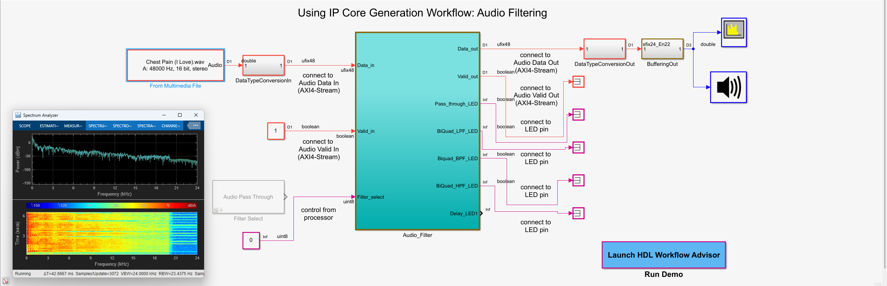
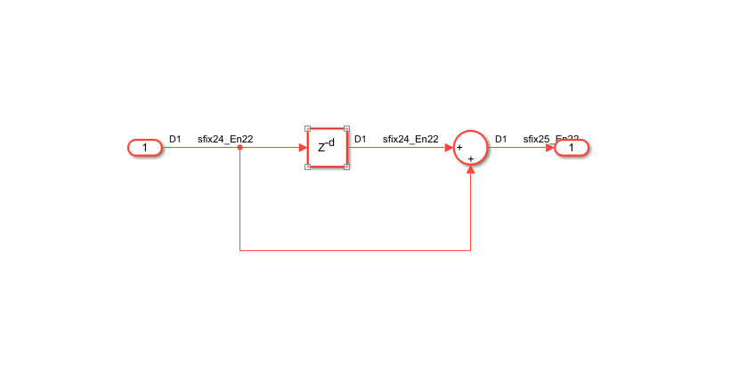
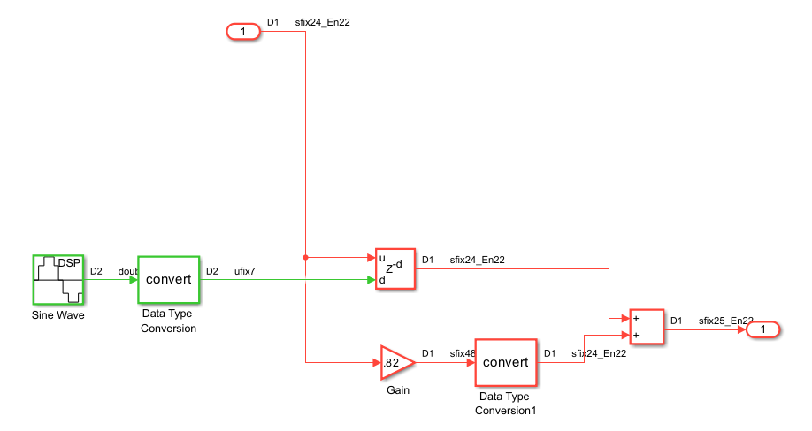
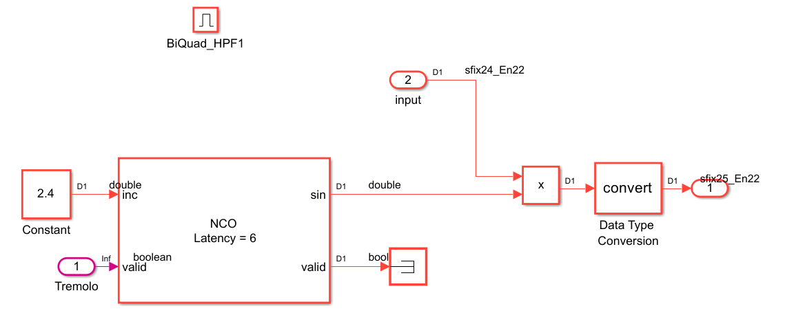

+++
date = '2026-01-11T00:01:09-05:00'
draft = false
title = 'HDL Guitar Effects Pedal'
+++

## Software

- Vivado 2022.1  
- MATLAB (any version should work!)

## Hardware

- Zybo Z7-10

## References

- [Authoring a Reference Design for Audio System on a ZYBO Board](https://www.mathworks.com/help/hdlcoder/ug/authoring-a-reference-design-for-audio-system-on-a-zybo-board.html)

- [Implement an Audio Filter on a Zynq Board](https://www.mathworks.com/help/hdlcoder/ug/running-an-audio-filter-on-live-audio-input-using-a-zynq-board.html)

- [Implement an Audio Filter on an Intel Board](https://www.mathworks.com/help/hdlcoder/ug/running-an-audio-filter-on-live-audio-input-using-an-intel-board.html)

# Background

This project was inspired from my love of guitar playing and FPGAs. A lot of designs use the PS side of the Zynq for DSP, which is cool but I wanted to challenge myself to design the DSP pipelines on the PL side and allow the PS to be used for configuring the effects. The general idea when it comes to HDL Coder is

- Create Reference design in Vivado
- Design IP-Core in Simulink
- Generate IP Core with HDL Coder
    - Simulink (HDL Workflow Advisor) will implant the IP-Core into the design

# Diagram

### Effects
- Delay

- Flanger (My favorite)

- Tremolo

- Linear Filters (LP/BP/HP)