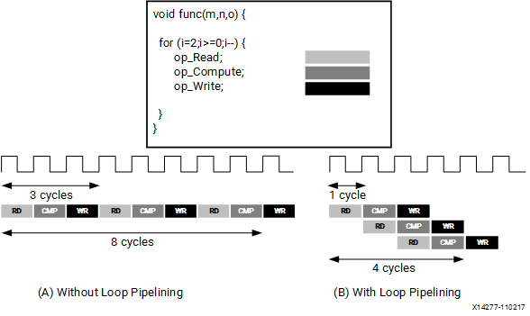

+++
date = '2026-01-25T00:01:09-05:00'
draft = false
title = 'Vitis HLS Loop Optimization'
+++

# Introduction

I am currently attending Georgia Tech and enrolled in ECE-8893 Parallel Programming for FPGAs. THe course is being taught by Instructor: Prof. Cong “Callie” Hao, who is AWESOME!. The course is a competition on who can design the fastest implementation of our labs on the PYNQ board. Our first lab is focused on loop optimization, and I thought I would discuss some of what I had learned.

(might be wrong, might be right.... but lets dive in)

# Documentation

Xilinx has some great documentation for all of their tools and they label them with 'UG'

Vitis High-Level Synthesis User Guide (UG1399)

This guide way helpful for explaining the "HLS Pragmas." In the class we were advised to not use the GUI, and stick to TCL scripts, but the GUI is actually very helpful in identifying which pragmas can actually be used and where. If you know what you're doing, you may not care.

## Pipelining

### #pragma HLS pipeline

