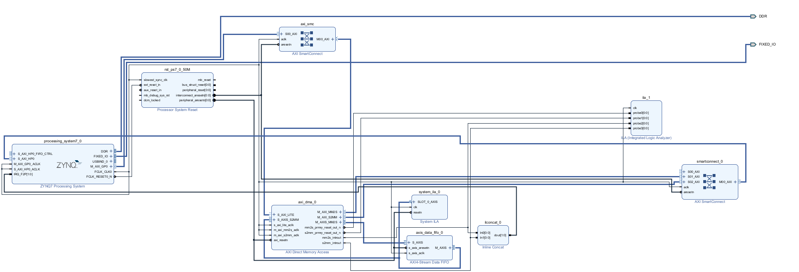

+++
date = '2026-07-04T00:01:09-05:00'
draft = false
title = 'Intrusion Detection System'
+++

# Introduction

Intrusion Detection system using Zybo

# Documentation

I hope I remember to get back to this, because the part where the CPU was too slow to process at 1Gbps was interesting.

### Block Design

