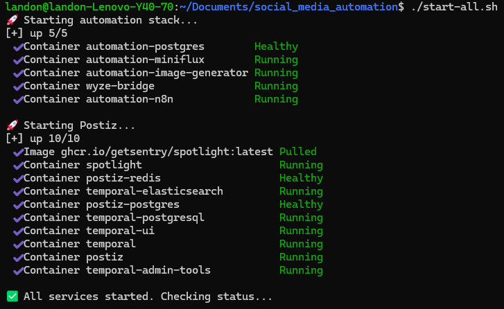
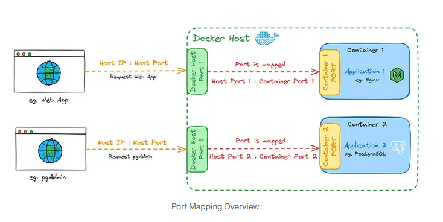

+++
date = '2026-05-08T00:01:09-05:00'
draft = false
title = 'Social Media Automation'
+++

# Introduction

The purpose of this project was to increase my social media presence in a stupid attempt to get some extra money on the side for doing practically nothing. With the help of claude, the stack was built using docker containers. I like this method of deployment. It allows me to keep applications separated, the toughest part is orchestrating them and keeping the host ports in order. Im self-hosting the applications to reduce cost, the ultimate goal was to create an instagram focused on FPGA / Embedded / Digital design (Fun stuff.... IKR)

# Application Stack

Postiz - Social media scheduling and management tool

Temporal - workflow orchestration engine (essentially will monitor for faults and re-run steps)

n8n - Visual workflow automation platform (connects all the services together)

Miniflux - Scrapes internet for articles

Postgres - database for miniflux (It stores all the feed subscriptions, fetched articles, read/unread status, and metadata.)

Ignore the wyze-bridge, that is what is control the stream on my website. 😂

# Setup

I needed to separate Postiz because I could not for the life of me get it to work in my 'automation' docker container. I typically resort to using the guide for the services when AI cannot figure it out, who would guess reading the instructions WORKS! after that it comes down to networking. getting your ports together is the name of the game. I would post my ports, but I dont want to make it that easy for anyone attacking my network.

Here is a visualization of Docker ports. Another tip, if any concepts confuse try '"X topic" visualizaion' in Google.

